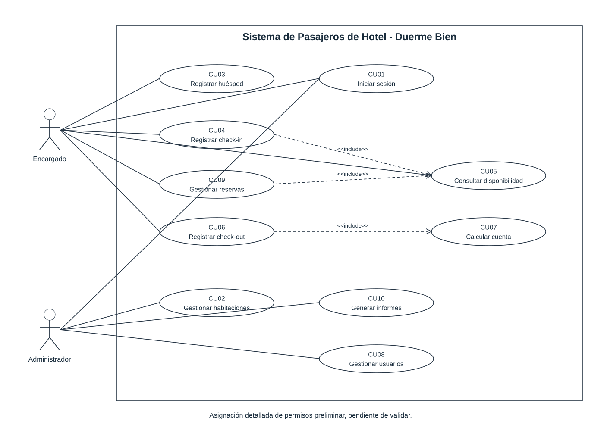
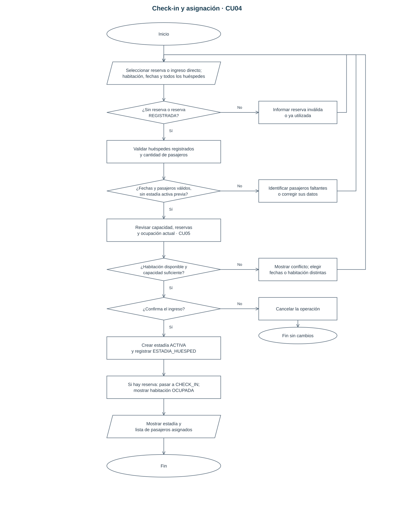
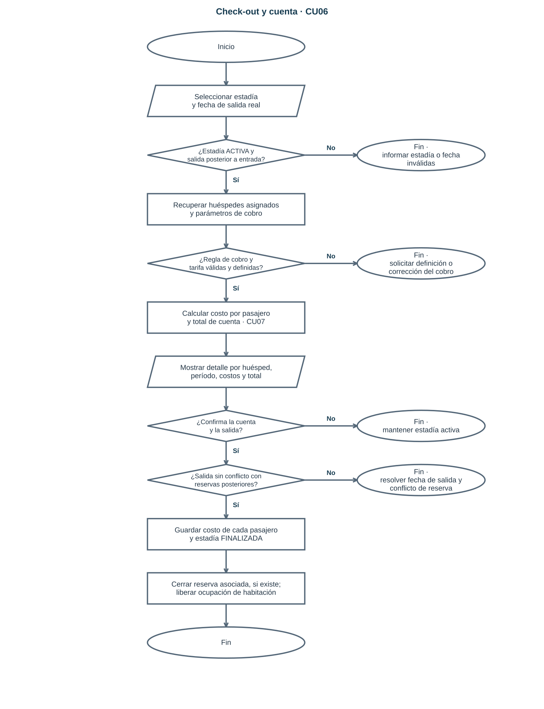
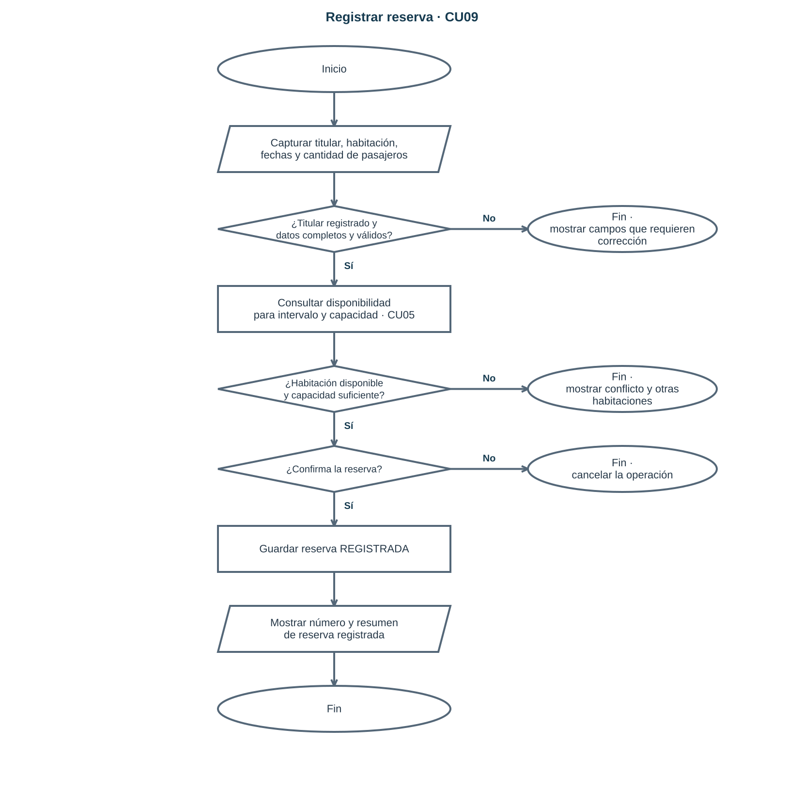
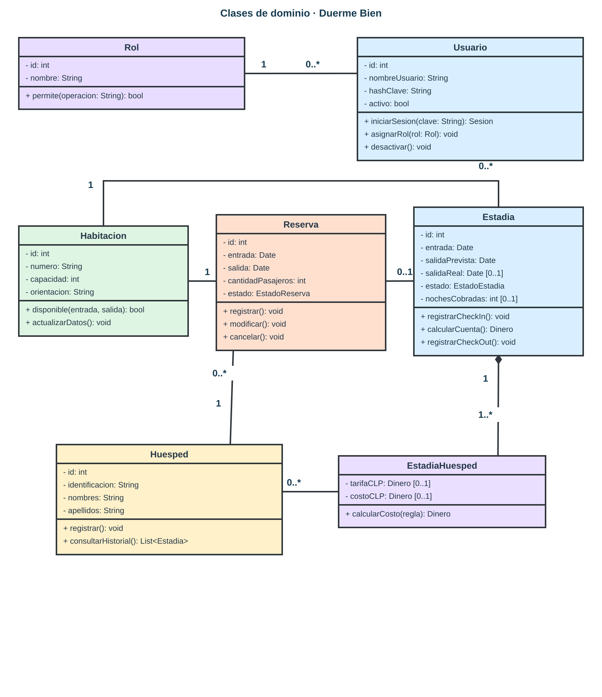
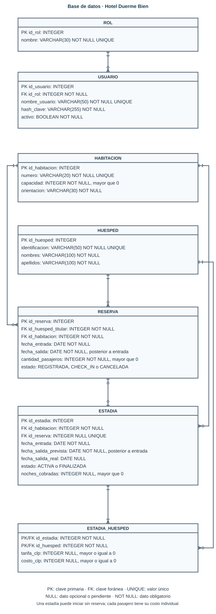
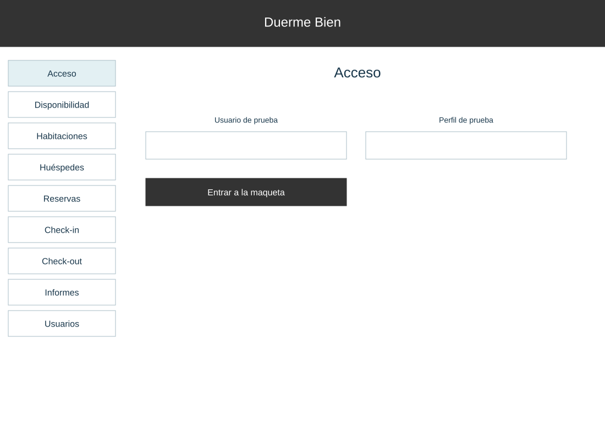
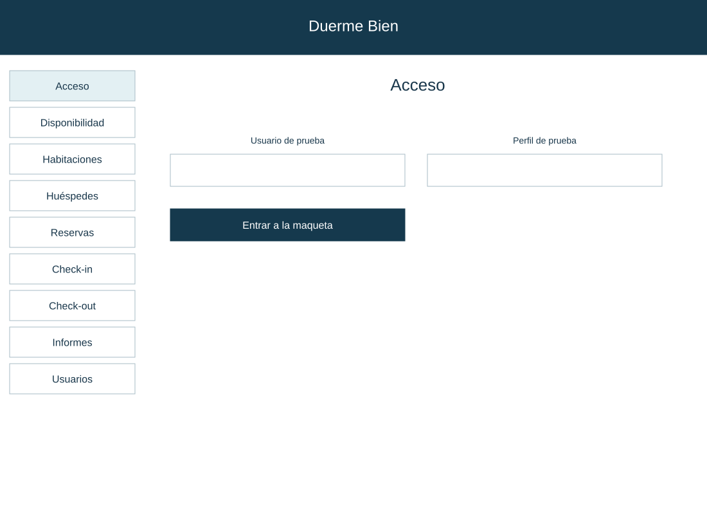
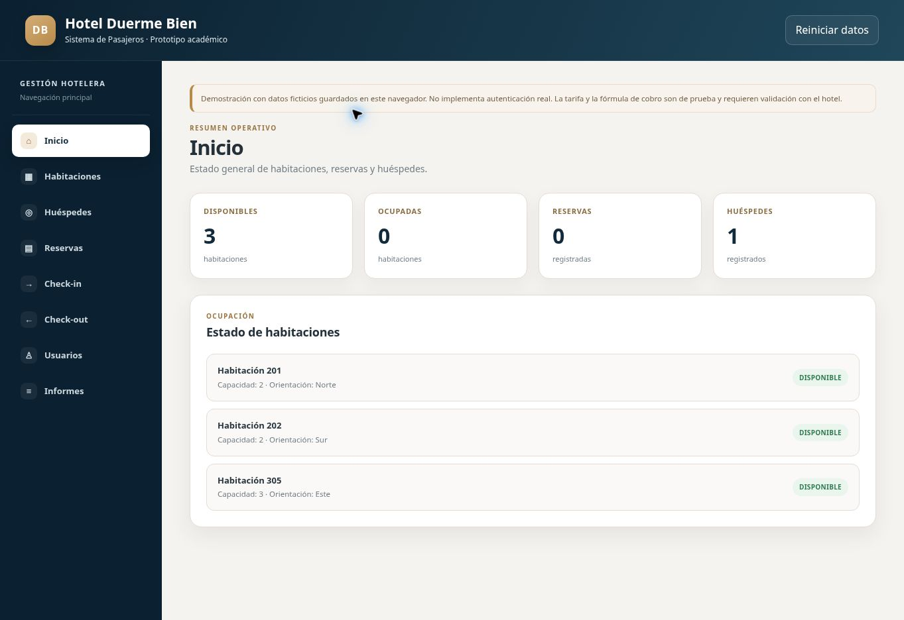

# Sistema de Pasajeros - Hotel Duerme Bien

**Tema 6 · Luis Huenchul**

[Ver entrega](https://yutre3.github.io/hotel-duerme-bien/) · [Abrir prototipo](https://yutre3.github.io/hotel-duerme-bien/prototipo/)

## Entrega

### 1. Informe de requerimientos

[Ver PDF](informe/informe-con-diagramas.pdf) · [Ver informe editable](informe/requerimientos-y-modelado.md)

### 2. Casos de uso

[Ver imagen](diagramas/casos-de-uso.svg) · [PDF](diagramas/casos-de-uso.pdf) · [Editar en diagrams.net](https://app.diagrams.net/?mode=github#HYutre3%2Fhotel-duerme-bien%2Fmain%2Fdiagramas-editables%2Fcasos-de-uso.drawio)

### 3. Flujo de check-in

[Ver imagen](diagramas/flujo-check-in.svg) · [PDF](diagramas/flujo-check-in.pdf) · [Editar en diagrams.net](https://app.diagrams.net/?mode=github#HYutre3%2Fhotel-duerme-bien%2Fmain%2Fdiagramas-editables%2Fflujo-check-in.drawio)

### 4. Flujo de check-out

[Ver imagen](diagramas/flujo-check-out.svg) · [PDF](diagramas/flujo-check-out.pdf) · [Editar en diagrams.net](https://app.diagrams.net/?mode=github#HYutre3%2Fhotel-duerme-bien%2Fmain%2Fdiagramas-editables%2Fflujo-check-out.drawio)

### 5. Flujo de reserva

[Ver imagen](diagramas/flujo-reserva.svg) · [PDF](diagramas/flujo-reserva.pdf) · [Editar en diagrams.net](https://app.diagrams.net/?mode=github#HYutre3%2Fhotel-duerme-bien%2Fmain%2Fdiagramas-editables%2Fflujo-reserva.drawio)

### 6. Diagrama de clases

[Ver imagen](diagramas/diagrama-de-clases.svg) · [PDF](diagramas/diagrama-de-clases.pdf) · [Editar en diagrams.net](https://app.diagrams.net/?mode=github#HYutre3%2Fhotel-duerme-bien%2Fmain%2Fdiagramas-editables%2Fdiagrama-de-clases.drawio)

### 7. Modelo de base de datos

[Ver imagen](diagramas/modelo-de-datos.svg) · [PDF](diagramas/modelo-de-datos.pdf) · [Editar en diagrams.net](https://app.diagrams.net/?mode=github#HYutre3%2Fhotel-duerme-bien%2Fmain%2Fdiagramas-editables%2Fmodelo-de-datos.drawio)

### 8. Wireframes y mockups

[Ver pantallas](https://yutre3.github.io/hotel-duerme-bien/mockups/) · [Editar las 9 pantallas en diagrams.net](https://app.diagrams.net/?mode=github#HYutre3%2Fhotel-duerme-bien%2Fmain%2Fdiagramas-editables%2Finterfaces.drawio) · [Editar HTML](https://github.dev/Yutre3/hotel-duerme-bien/blob/main/mockups/index.html)

### 9. Prototipo funcional

[Abrir prototipo](https://yutre3.github.io/hotel-duerme-bien/prototipo/) · [Editar código](https://github.dev/Yutre3/hotel-duerme-bien/tree/main/prototipo)

### 10. Kanban

[Ver Kanban](planificacion/kanban.md) · [Editar](https://github.dev/Yutre3/hotel-duerme-bien/blob/main/planificacion/kanban.md)

### Materiales y referencias

[Materiales originales](fuentes/) · [Referencia](https://github.com/Yutre3/diego) · [Código y pruebas](tests/prototipo.test.cjs)
