# Sistema de Pasajeros - Hotel Duerme Bien

**Tema 6 · Luis Huenchul**

[Ver entrega](https://yutre3.github.io/hotel-duerme-bien/) · [Abrir prototipo](https://yutre3.github.io/hotel-duerme-bien/prototipo/)

## Entrega

### 1. Informe de requerimientos

[Informe PDF completo](informe/informe-con-diagramas.pdf) · [Informe editable](informe/requerimientos-y-modelado.md)

### 2. Casos de uso · Operación

[Ver imagen](diagramas/casos-de-uso.svg) · [PDF](diagramas/casos-de-uso.pdf) · [Editar](https://app.diagrams.net/?mode=device#Uhttps%3A%2F%2Fraw.githubusercontent.com%2FYutre3%2Fhotel-duerme-bien%2Fmain%2Fdiagramas-editables%2Fcasos-de-uso.drawio)

### 3. Casos de uso · Administración

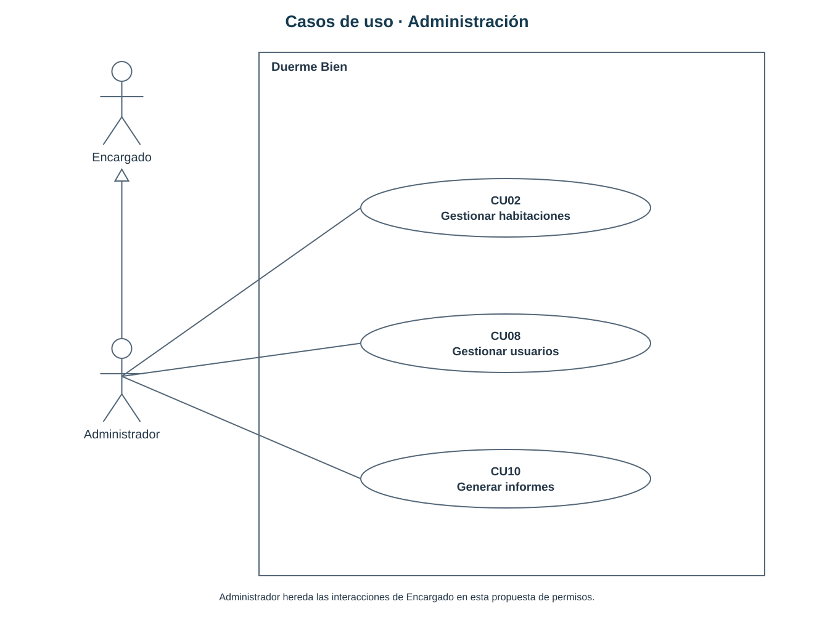

[Ver imagen](diagramas/casos-de-uso-administracion.svg) · [PDF](diagramas/casos-de-uso-administracion.pdf) · [Editar](https://app.diagrams.net/?mode=device#Uhttps%3A%2F%2Fraw.githubusercontent.com%2FYutre3%2Fhotel-duerme-bien%2Fmain%2Fdiagramas-editables%2Fcasos-de-uso-administracion.drawio)

### 4. Registro de reserva

[Ver imagen](diagramas/flujo-reserva.svg) · [PDF](diagramas/flujo-reserva.pdf) · [Editar](https://app.diagrams.net/?mode=device#Uhttps%3A%2F%2Fraw.githubusercontent.com%2FYutre3%2Fhotel-duerme-bien%2Fmain%2Fdiagramas-editables%2Fflujo-reserva.drawio)

### 5. Modificación y cancelación

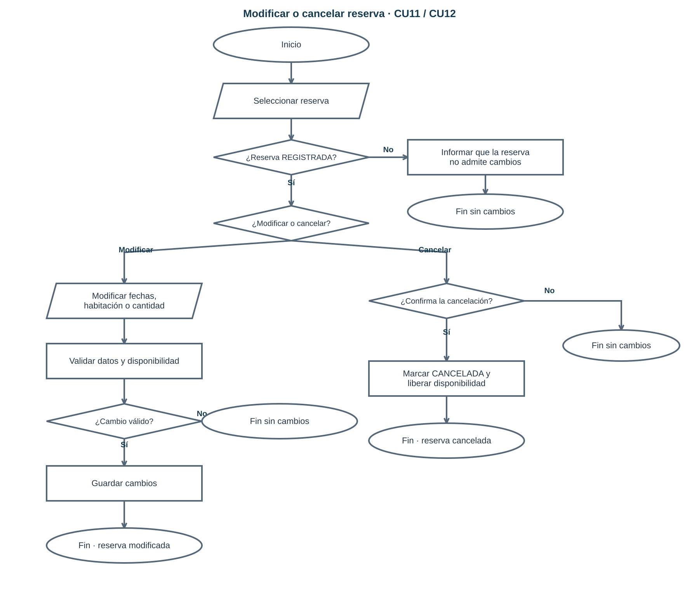

[Ver imagen](diagramas/flujo-gestion-reservas.svg) · [PDF](diagramas/flujo-gestion-reservas.pdf) · [Editar](https://app.diagrams.net/?mode=device#Uhttps%3A%2F%2Fraw.githubusercontent.com%2FYutre3%2Fhotel-duerme-bien%2Fmain%2Fdiagramas-editables%2Fflujo-gestion-reservas.drawio)

### 6. Check-in

[Ver imagen](diagramas/flujo-check-in.svg) · [PDF](diagramas/flujo-check-in.pdf) · [Editar](https://app.diagrams.net/?mode=device#Uhttps%3A%2F%2Fraw.githubusercontent.com%2FYutre3%2Fhotel-duerme-bien%2Fmain%2Fdiagramas-editables%2Fflujo-check-in.drawio)

### 7. Check-out

[Ver imagen](diagramas/flujo-check-out.svg) · [PDF](diagramas/flujo-check-out.pdf) · [Editar](https://app.diagrams.net/?mode=device#Uhttps%3A%2F%2Fraw.githubusercontent.com%2FYutre3%2Fhotel-duerme-bien%2Fmain%2Fdiagramas-editables%2Fflujo-check-out.drawio)

### 8. Clases de dominio

[Ver imagen](diagramas/diagrama-de-clases.svg) · [PDF](diagramas/diagrama-de-clases.pdf) · [Editar](https://app.diagrams.net/?mode=device#Uhttps%3A%2F%2Fraw.githubusercontent.com%2FYutre3%2Fhotel-duerme-bien%2Fmain%2Fdiagramas-editables%2Fdiagrama-de-clases.drawio)

### 9. Modelo lógico de base de datos

[Ver imagen](diagramas/modelo-de-datos.svg) · [PDF](diagramas/modelo-de-datos.pdf) · [Editar](https://app.diagrams.net/?mode=device#Uhttps%3A%2F%2Fraw.githubusercontent.com%2FYutre3%2Fhotel-duerme-bien%2Fmain%2Fdiagramas-editables%2Fmodelo-de-datos.drawio)

### 10. Sketch

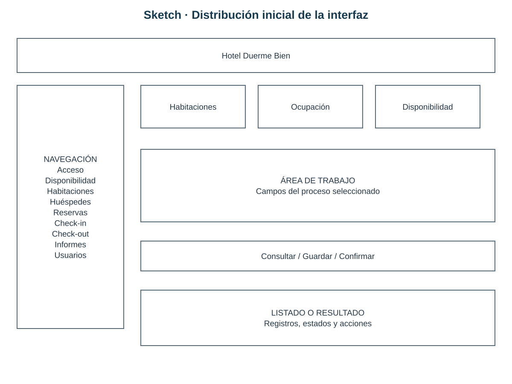

[Editar](https://app.diagrams.net/?mode=device#Uhttps%3A%2F%2Fraw.githubusercontent.com%2FYutre3%2Fhotel-duerme-bien%2Fmain%2Fdiagramas-editables%2Fsketch.drawio)

### 11. Wireframes y mockups

[Ver las nueve pantallas](https://yutre3.github.io/hotel-duerme-bien/mockups/) · [Editar todas las vistas](https://app.diagrams.net/?mode=device#Uhttps%3A%2F%2Fraw.githubusercontent.com%2FYutre3%2Fhotel-duerme-bien%2Fmain%2Fdiagramas-editables%2Finterfaces.drawio)

| Pantalla | Wireframe | Mockup | Editar |
|---|---|---|---|
| Acceso | 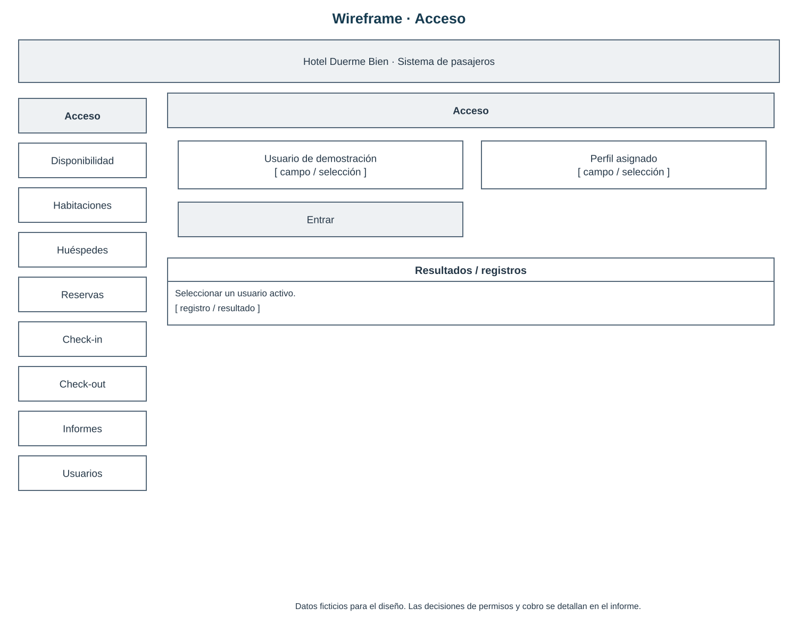 | 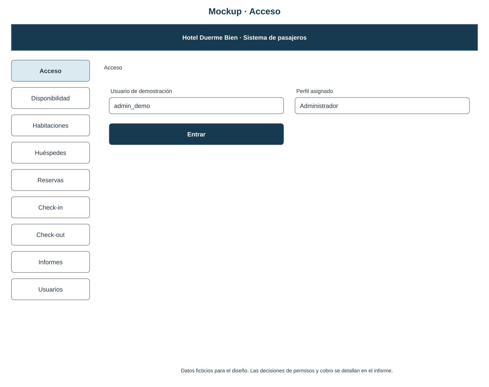 | [Wireframe](https://app.diagrams.net/?mode=device#Uhttps%3A%2F%2Fraw.githubusercontent.com%2FYutre3%2Fhotel-duerme-bien%2Fmain%2Fdiagramas-editables%2Fwireframe-acceso.drawio) · [Mockup](https://app.diagrams.net/?mode=device#Uhttps%3A%2F%2Fraw.githubusercontent.com%2FYutre3%2Fhotel-duerme-bien%2Fmain%2Fdiagramas-editables%2Fmockup-acceso.drawio) |
| Disponibilidad | 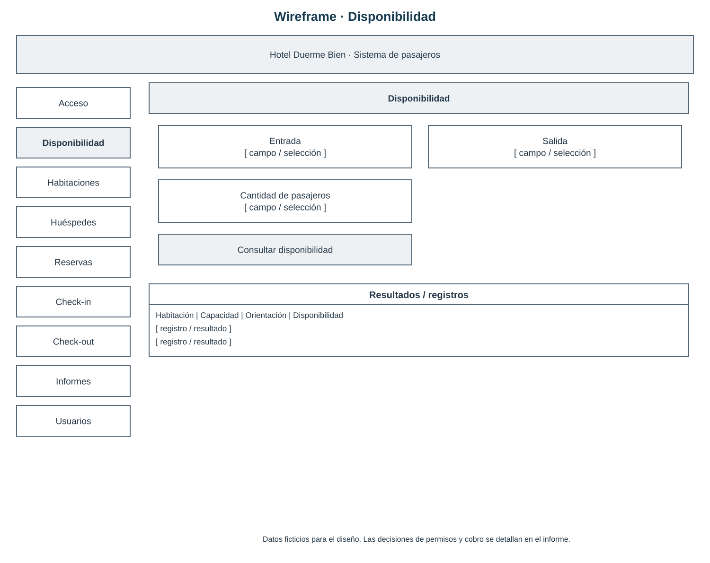 |  | [Wireframe](https://app.diagrams.net/?mode=device#Uhttps%3A%2F%2Fraw.githubusercontent.com%2FYutre3%2Fhotel-duerme-bien%2Fmain%2Fdiagramas-editables%2Fwireframe-disponibilidad.drawio) · [Mockup](https://app.diagrams.net/?mode=device#Uhttps%3A%2F%2Fraw.githubusercontent.com%2FYutre3%2Fhotel-duerme-bien%2Fmain%2Fdiagramas-editables%2Fmockup-disponibilidad.drawio) |
| Habitaciones | 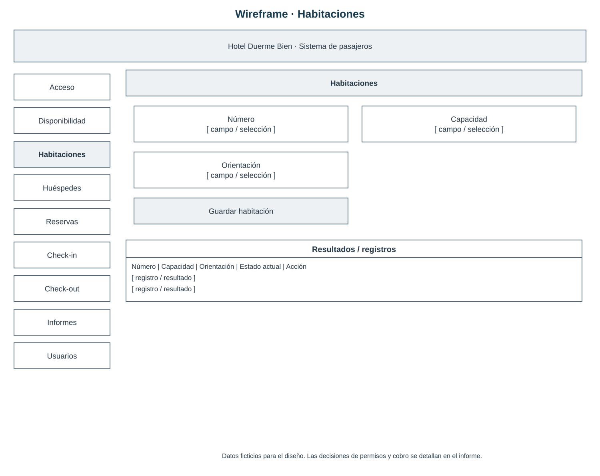 | 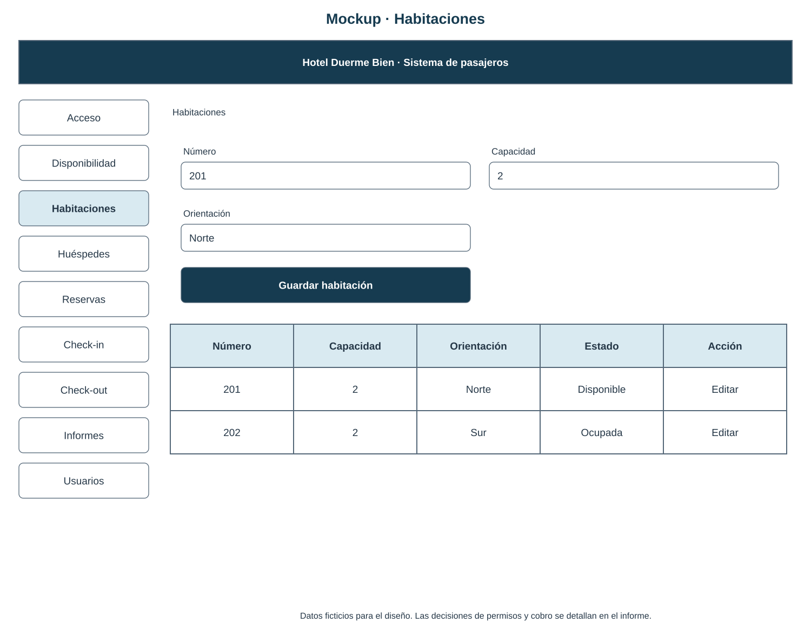 | [Wireframe](https://app.diagrams.net/?mode=device#Uhttps%3A%2F%2Fraw.githubusercontent.com%2FYutre3%2Fhotel-duerme-bien%2Fmain%2Fdiagramas-editables%2Fwireframe-habitaciones.drawio) · [Mockup](https://app.diagrams.net/?mode=device#Uhttps%3A%2F%2Fraw.githubusercontent.com%2FYutre3%2Fhotel-duerme-bien%2Fmain%2Fdiagramas-editables%2Fmockup-habitaciones.drawio) |
| Huéspedes | 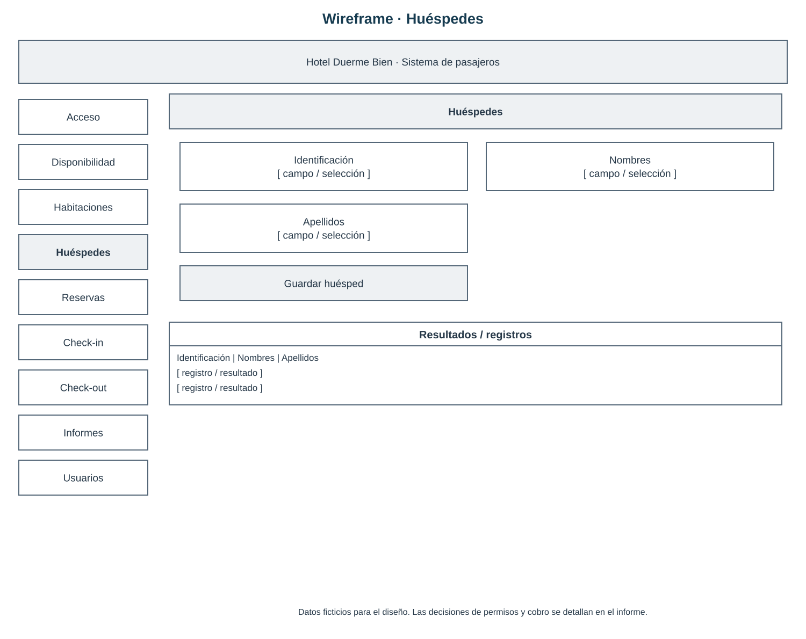 |  | [Wireframe](https://app.diagrams.net/?mode=device#Uhttps%3A%2F%2Fraw.githubusercontent.com%2FYutre3%2Fhotel-duerme-bien%2Fmain%2Fdiagramas-editables%2Fwireframe-huespedes.drawio) · [Mockup](https://app.diagrams.net/?mode=device#Uhttps%3A%2F%2Fraw.githubusercontent.com%2FYutre3%2Fhotel-duerme-bien%2Fmain%2Fdiagramas-editables%2Fmockup-huespedes.drawio) |
| Reservas | 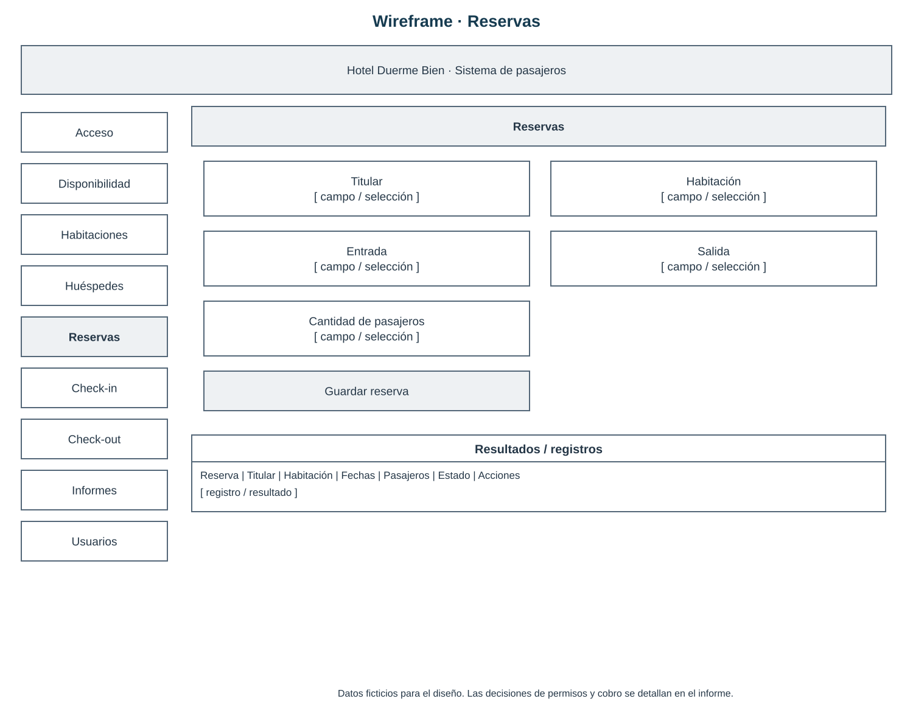 | 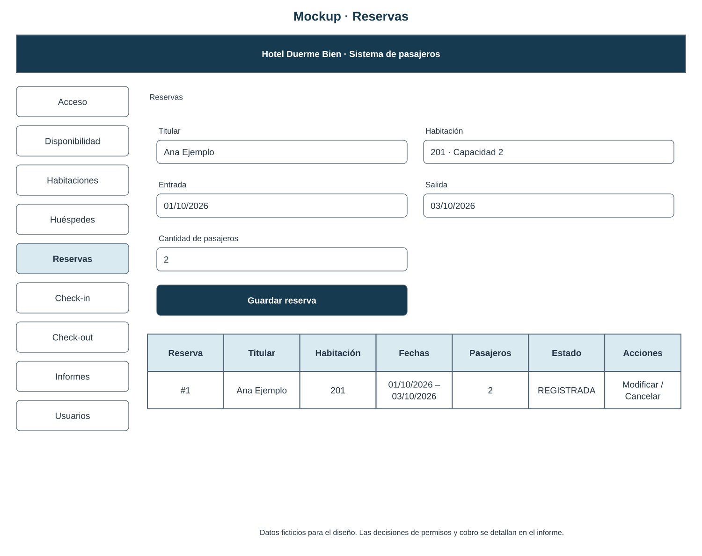 | [Wireframe](https://app.diagrams.net/?mode=device#Uhttps%3A%2F%2Fraw.githubusercontent.com%2FYutre3%2Fhotel-duerme-bien%2Fmain%2Fdiagramas-editables%2Fwireframe-reservas.drawio) · [Mockup](https://app.diagrams.net/?mode=device#Uhttps%3A%2F%2Fraw.githubusercontent.com%2FYutre3%2Fhotel-duerme-bien%2Fmain%2Fdiagramas-editables%2Fmockup-reservas.drawio) |
| Check-in | 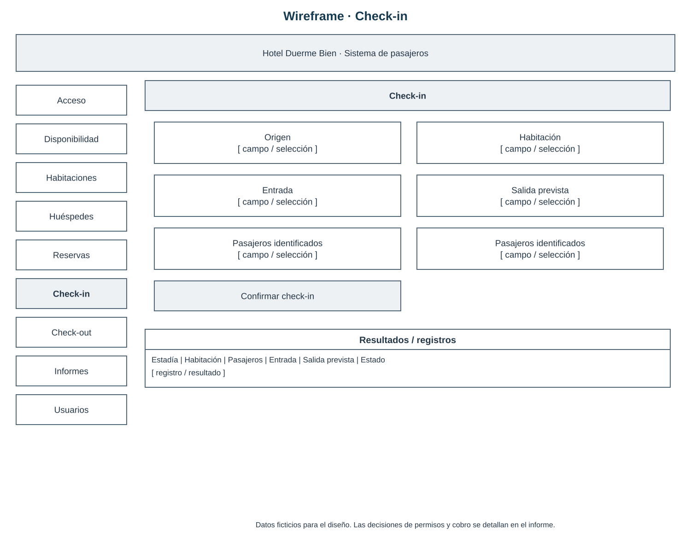 | 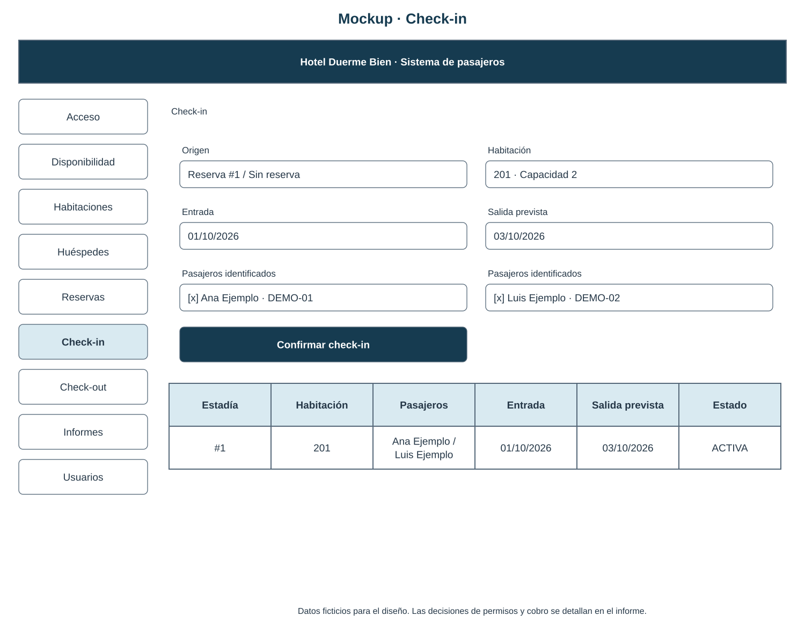 | [Wireframe](https://app.diagrams.net/?mode=device#Uhttps%3A%2F%2Fraw.githubusercontent.com%2FYutre3%2Fhotel-duerme-bien%2Fmain%2Fdiagramas-editables%2Fwireframe-checkin.drawio) · [Mockup](https://app.diagrams.net/?mode=device#Uhttps%3A%2F%2Fraw.githubusercontent.com%2FYutre3%2Fhotel-duerme-bien%2Fmain%2Fdiagramas-editables%2Fmockup-checkin.drawio) |
| Check-out | 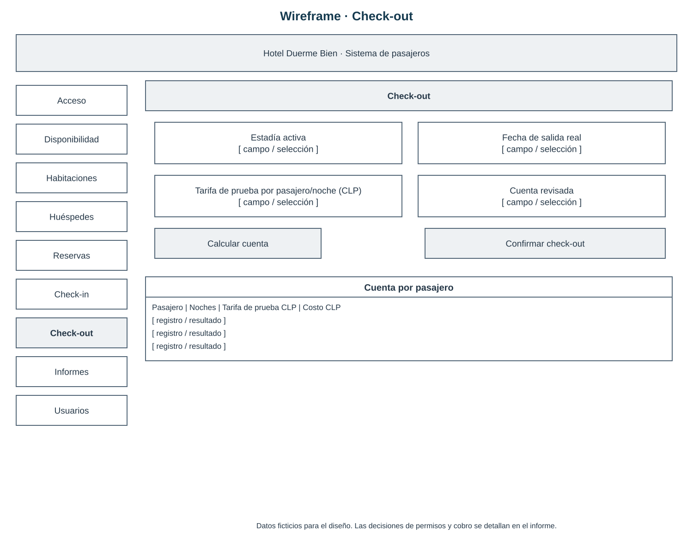 | 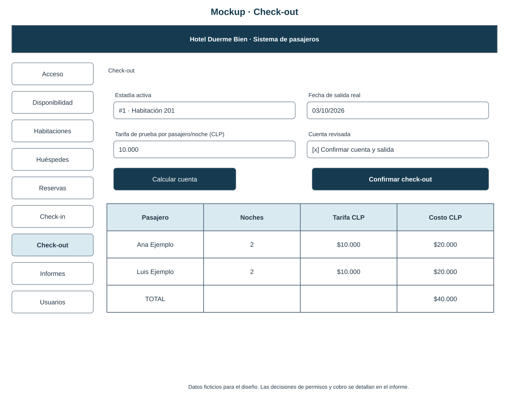 | [Wireframe](https://app.diagrams.net/?mode=device#Uhttps%3A%2F%2Fraw.githubusercontent.com%2FYutre3%2Fhotel-duerme-bien%2Fmain%2Fdiagramas-editables%2Fwireframe-checkout.drawio) · [Mockup](https://app.diagrams.net/?mode=device#Uhttps%3A%2F%2Fraw.githubusercontent.com%2FYutre3%2Fhotel-duerme-bien%2Fmain%2Fdiagramas-editables%2Fmockup-checkout.drawio) |
| Informes | 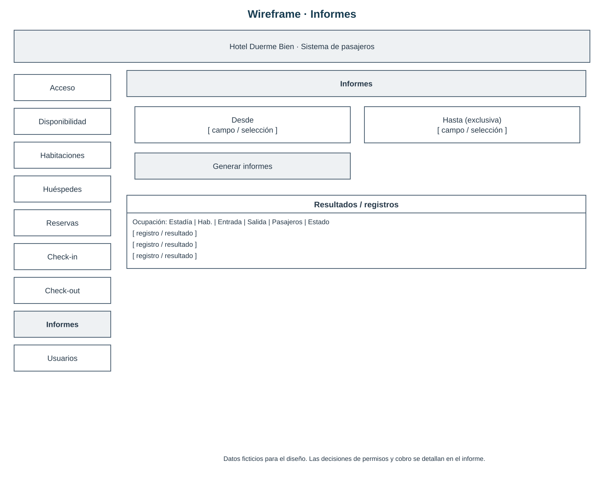 | 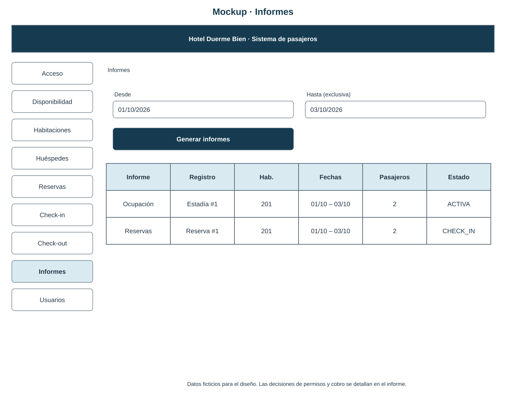 | [Wireframe](https://app.diagrams.net/?mode=device#Uhttps%3A%2F%2Fraw.githubusercontent.com%2FYutre3%2Fhotel-duerme-bien%2Fmain%2Fdiagramas-editables%2Fwireframe-informes.drawio) · [Mockup](https://app.diagrams.net/?mode=device#Uhttps%3A%2F%2Fraw.githubusercontent.com%2FYutre3%2Fhotel-duerme-bien%2Fmain%2Fdiagramas-editables%2Fmockup-informes.drawio) |
| Usuarios | 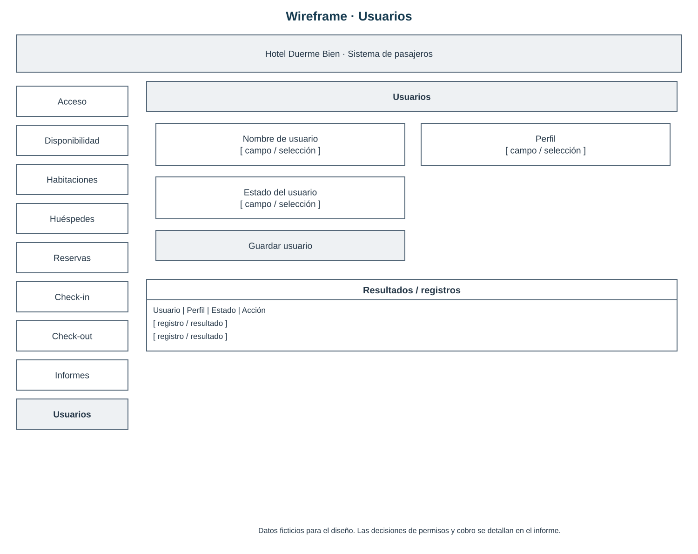 | 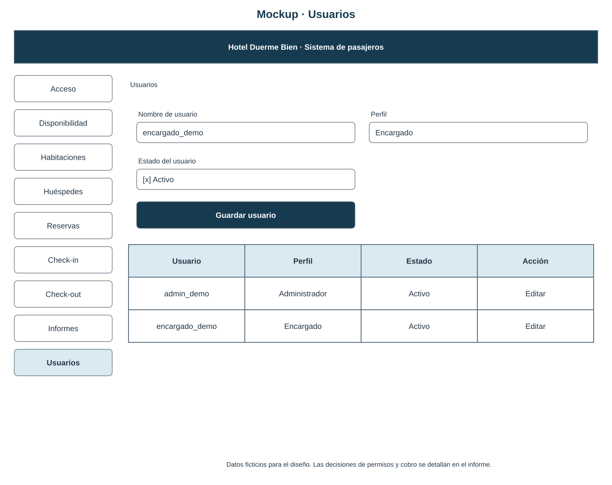 | [Wireframe](https://app.diagrams.net/?mode=device#Uhttps%3A%2F%2Fraw.githubusercontent.com%2FYutre3%2Fhotel-duerme-bien%2Fmain%2Fdiagramas-editables%2Fwireframe-usuarios.drawio) · [Mockup](https://app.diagrams.net/?mode=device#Uhttps%3A%2F%2Fraw.githubusercontent.com%2FYutre3%2Fhotel-duerme-bien%2Fmain%2Fdiagramas-editables%2Fmockup-usuarios.drawio) |

### 12. Prototipo funcional

[Abrir prototipo](https://yutre3.github.io/hotel-duerme-bien/prototipo/) · [Editar código](https://github.dev/Yutre3/hotel-duerme-bien/tree/main/prototipo)

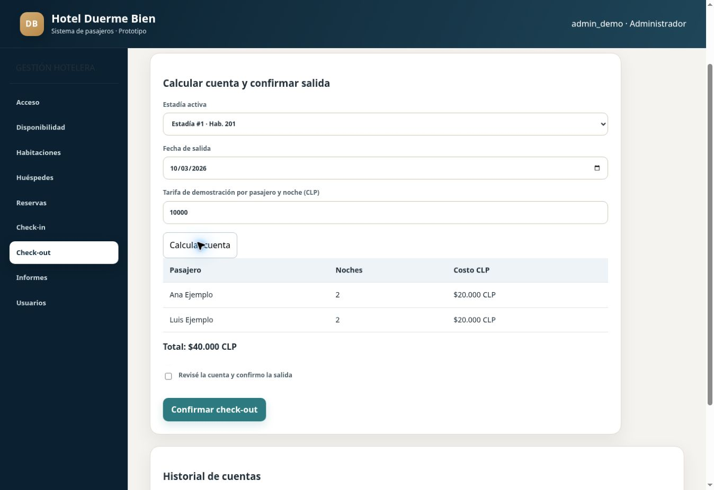

### 13. Kanban

[Ver tablero](planificacion/kanban.md) · [Editar](https://app.diagrams.net/?mode=device#Uhttps%3A%2F%2Fraw.githubusercontent.com%2FYutre3%2Fhotel-duerme-bien%2Fmain%2Fdiagramas-editables%2Fkanban.drawio)

### Materiales y referencias

[Materiales originales](https://github.com/Yutre3/hotel-duerme-bien/tree/main/fuentes) · [Referencias técnicas](informe/requerimientos-y-modelado.md#12-referencias) · [Repositorio de referencia](https://github.com/Yutre3/diego) · [Pruebas](tests/prototipo.test.cjs)
