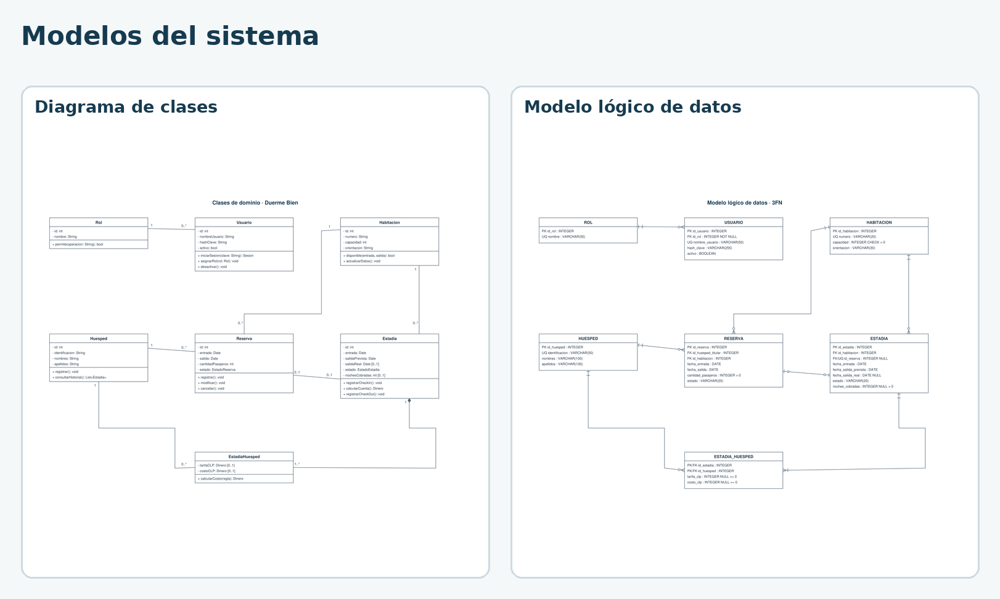
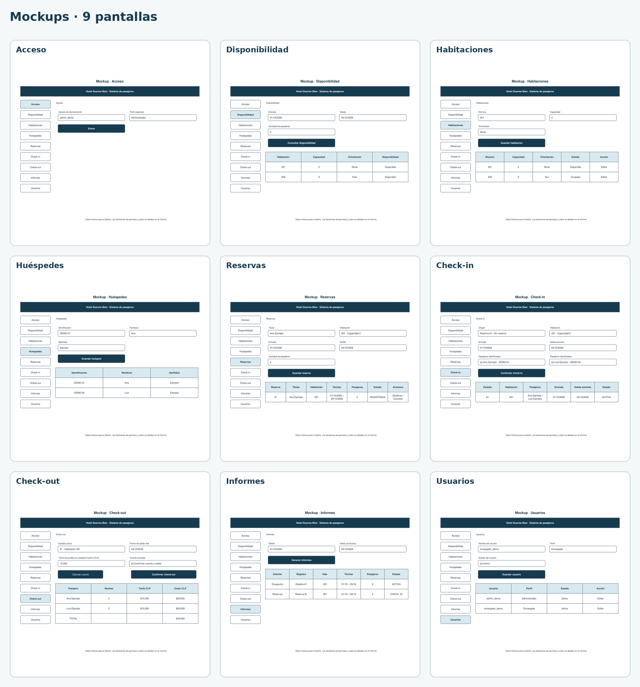

# Sistema de Pasajeros · Hotel Duerme Bien

**Tema 6 · Luis Huenchul**

[Ver entrega](https://yutre3.github.io/hotel-duerme-bien/) · [Probar demo](https://yutre3.github.io/hotel-duerme-bien/prototipo/) · [Informe completo](informe/informe-con-diagramas.pdf)

## Informe

[Informe PDF completo](informe/informe-con-diagramas.pdf) · [Documento editable](informe/requerimientos-y-modelado.md)

## Casos de uso

[Operación](diagramas/casos-de-uso.svg) · [Administración](diagramas/casos-de-uso-administracion.svg) · [Editar operación](https://app.diagrams.net/?mode=device#Uhttps%3A%2F%2Fraw.githubusercontent.com%2FYutre3%2Fhotel-duerme-bien%2Fmain%2Fdiagramas-editables%2Fcasos-de-uso.drawio) · [Editar administración](https://app.diagrams.net/?mode=device#Uhttps%3A%2F%2Fraw.githubusercontent.com%2FYutre3%2Fhotel-duerme-bien%2Fmain%2Fdiagramas-editables%2Fcasos-de-uso-administracion.drawio)

## Diagramas de procesos

[Reserva](diagramas/flujo-reserva.svg) · [Modificar o cancelar](diagramas/flujo-gestion-reservas.svg) · [Check-in](diagramas/flujo-check-in.svg) · [Check-out](diagramas/flujo-check-out.svg)

## Modelos del sistema

[Clases](diagramas/diagrama-de-clases.svg) · [Base de datos](diagramas/modelo-de-datos.svg) · [Editar clases](https://app.diagrams.net/?mode=device#Uhttps%3A%2F%2Fraw.githubusercontent.com%2FYutre3%2Fhotel-duerme-bien%2Fmain%2Fdiagramas-editables%2Fdiagrama-de-clases.drawio) · [Editar datos](https://app.diagrams.net/?mode=device#Uhttps%3A%2F%2Fraw.githubusercontent.com%2FYutre3%2Fhotel-duerme-bien%2Fmain%2Fdiagramas-editables%2Fmodelo-de-datos.drawio)

## Sketch

[PDF](mockups/sketch.pdf) · [Editar](https://app.diagrams.net/?mode=device#Uhttps%3A%2F%2Fraw.githubusercontent.com%2FYutre3%2Fhotel-duerme-bien%2Fmain%2Fdiagramas-editables%2Fsketch.drawio)

## Wireframes

[Galería de las nueve pantallas](https://yutre3.github.io/hotel-duerme-bien/mockups/) · [Editar todas las vistas](https://app.diagrams.net/?mode=device#Uhttps%3A%2F%2Fraw.githubusercontent.com%2FYutre3%2Fhotel-duerme-bien%2Fmain%2Fdiagramas-editables%2Finterfaces.drawio)

## Mockups

[Galería de las nueve pantallas](https://yutre3.github.io/hotel-duerme-bien/mockups/) · [Editar todas las vistas](https://app.diagrams.net/?mode=device#Uhttps%3A%2F%2Fraw.githubusercontent.com%2FYutre3%2Fhotel-duerme-bien%2Fmain%2Fdiagramas-editables%2Finterfaces.drawio)

## Demo funcional

[Abrir demo](https://yutre3.github.io/hotel-duerme-bien/prototipo/) · [Editar código](https://github.dev/Yutre3/hotel-duerme-bien/tree/main/prototipo)

## Kanban

[Ver tablero](planificacion/kanban.md) · [PDF](diagramas/kanban.pdf) · [Editar](https://app.diagrams.net/?mode=device#Uhttps%3A%2F%2Fraw.githubusercontent.com%2FYutre3%2Fhotel-duerme-bien%2Fmain%2Fdiagramas-editables%2Fkanban.drawio)

## Materiales

[Archivos originales](https://github.com/Yutre3/hotel-duerme-bien/tree/main/fuentes) · [Referencias](informe/requerimientos-y-modelado.md#12-referencias) · [Pruebas](tests/)
