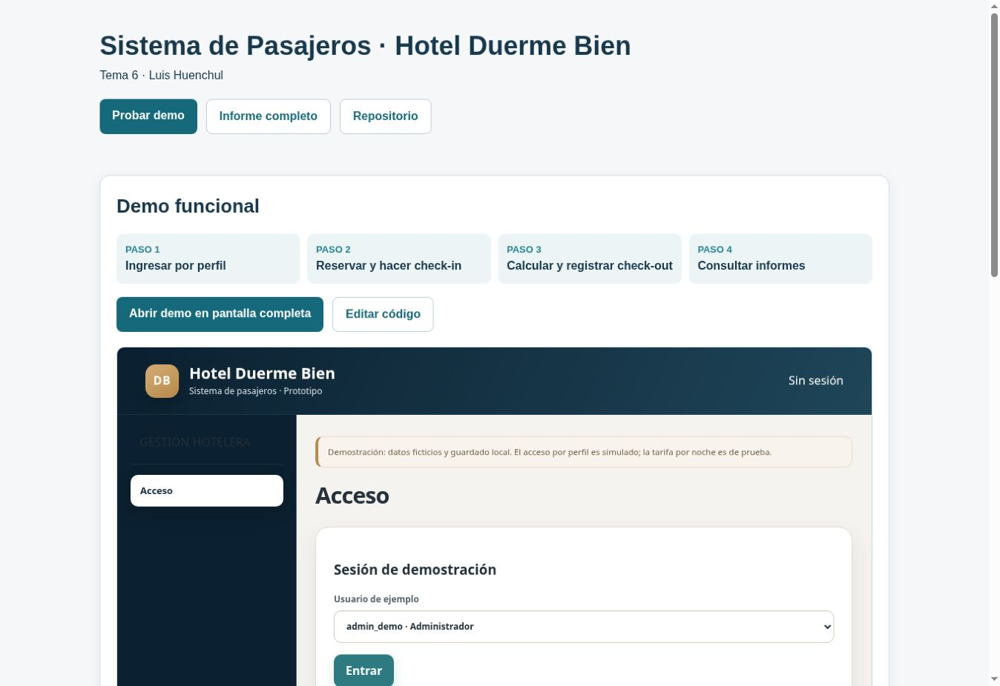

# Sistema de Pasajeros · Hotel Duerme Bien

**Tema 6 · Luis Huenchul**

[Ver entrega](https://yutre3.github.io/hotel-duerme-bien/) · [Probar demo](https://yutre3.github.io/hotel-duerme-bien/prototipo/) · [Informe completo](informe/informe-con-diagramas.pdf)

## Informe

[Informe PDF completo](informe/informe-con-diagramas.pdf) · [Documento editable](informe/requerimientos-y-modelado.md)

## Diagramas

### 1. Casos de uso · Operación

[Ver imagen](diagramas/casos-de-uso.svg) · [PDF](diagramas/casos-de-uso.pdf) · [Editar en diagrams.net](https://app.diagrams.net/?mode=device#Uhttps%3A%2F%2Fraw.githubusercontent.com%2FYutre3%2Fhotel-duerme-bien%2Fmain%2Fdiagramas-editables%2Fcasos-de-uso.drawio)

### 2. Casos de uso · Administración

[Ver imagen](diagramas/casos-de-uso-administracion.svg) · [PDF](diagramas/casos-de-uso-administracion.pdf) · [Editar en diagrams.net](https://app.diagrams.net/?mode=device#Uhttps%3A%2F%2Fraw.githubusercontent.com%2FYutre3%2Fhotel-duerme-bien%2Fmain%2Fdiagramas-editables%2Fcasos-de-uso-administracion.drawio)

### 3. Registro de reserva

[Ver imagen](diagramas/flujo-reserva.svg) · [PDF](diagramas/flujo-reserva.pdf) · [Editar en diagrams.net](https://app.diagrams.net/?mode=device#Uhttps%3A%2F%2Fraw.githubusercontent.com%2FYutre3%2Fhotel-duerme-bien%2Fmain%2Fdiagramas-editables%2Fflujo-reserva.drawio)

### 4. Modificación y cancelación

[Ver imagen](diagramas/flujo-gestion-reservas.svg) · [PDF](diagramas/flujo-gestion-reservas.pdf) · [Editar en diagrams.net](https://app.diagrams.net/?mode=device#Uhttps%3A%2F%2Fraw.githubusercontent.com%2FYutre3%2Fhotel-duerme-bien%2Fmain%2Fdiagramas-editables%2Fflujo-gestion-reservas.drawio)

### 5. Check-in

[Ver imagen](diagramas/flujo-check-in.svg) · [PDF](diagramas/flujo-check-in.pdf) · [Editar en diagrams.net](https://app.diagrams.net/?mode=device#Uhttps%3A%2F%2Fraw.githubusercontent.com%2FYutre3%2Fhotel-duerme-bien%2Fmain%2Fdiagramas-editables%2Fflujo-check-in.drawio)

### 6. Check-out

[Ver imagen](diagramas/flujo-check-out.svg) · [PDF](diagramas/flujo-check-out.pdf) · [Editar en diagrams.net](https://app.diagrams.net/?mode=device#Uhttps%3A%2F%2Fraw.githubusercontent.com%2FYutre3%2Fhotel-duerme-bien%2Fmain%2Fdiagramas-editables%2Fflujo-check-out.drawio)

### 7. Clases de dominio

[Ver imagen](diagramas/diagrama-de-clases.svg) · [PDF](diagramas/diagrama-de-clases.pdf) · [Editar en diagrams.net](https://app.diagrams.net/?mode=device#Uhttps%3A%2F%2Fraw.githubusercontent.com%2FYutre3%2Fhotel-duerme-bien%2Fmain%2Fdiagramas-editables%2Fdiagrama-de-clases.drawio)

### 8. Modelo lógico de base de datos

[Ver imagen](diagramas/modelo-de-datos.svg) · [PDF](diagramas/modelo-de-datos.pdf) · [Editar en diagrams.net](https://app.diagrams.net/?mode=device#Uhttps%3A%2F%2Fraw.githubusercontent.com%2FYutre3%2Fhotel-duerme-bien%2Fmain%2Fdiagramas-editables%2Fmodelo-de-datos.drawio)

## Sketch

[PDF](mockups/sketch.pdf) · [Editar en diagrams.net](https://app.diagrams.net/?mode=device#Uhttps%3A%2F%2Fraw.githubusercontent.com%2FYutre3%2Fhotel-duerme-bien%2Fmain%2Fdiagramas-editables%2Fsketch.drawio)

## Wireframes y mockups

[Galería completa](https://yutre3.github.io/hotel-duerme-bien/mockups/) · [Editar todas las vistas](https://app.diagrams.net/?mode=device#Uhttps%3A%2F%2Fraw.githubusercontent.com%2FYutre3%2Fhotel-duerme-bien%2Fmain%2Fdiagramas-editables%2Finterfaces.drawio)

<table>
<tr>
<td width="50%"><strong>Acceso</strong>  <a href="mockups/wireframe-acceso.svg">Wireframe</a> · <a href="https://app.diagrams.net/?mode=device#Uhttps%3A%2F%2Fraw.githubusercontent.com%2FYutre3%2Fhotel-duerme-bien%2Fmain%2Fdiagramas-editables%2Fmockup-acceso.drawio">Editar</a></td>
<td width="50%"><strong>Disponibilidad</strong>  <a href="mockups/wireframe-disponibilidad.svg">Wireframe</a> · <a href="https://app.diagrams.net/?mode=device#Uhttps%3A%2F%2Fraw.githubusercontent.com%2FYutre3%2Fhotel-duerme-bien%2Fmain%2Fdiagramas-editables%2Fmockup-disponibilidad.drawio">Editar</a></td>
</tr>
<tr>
<td width="50%"><strong>Habitaciones</strong>  <a href="mockups/wireframe-habitaciones.svg">Wireframe</a> · <a href="https://app.diagrams.net/?mode=device#Uhttps%3A%2F%2Fraw.githubusercontent.com%2FYutre3%2Fhotel-duerme-bien%2Fmain%2Fdiagramas-editables%2Fmockup-habitaciones.drawio">Editar</a></td>
<td width="50%"><strong>Huéspedes</strong>  <a href="mockups/wireframe-huespedes.svg">Wireframe</a> · <a href="https://app.diagrams.net/?mode=device#Uhttps%3A%2F%2Fraw.githubusercontent.com%2FYutre3%2Fhotel-duerme-bien%2Fmain%2Fdiagramas-editables%2Fmockup-huespedes.drawio">Editar</a></td>
</tr>
<tr>
<td width="50%"><strong>Reservas</strong>  <a href="mockups/wireframe-reservas.svg">Wireframe</a> · <a href="https://app.diagrams.net/?mode=device#Uhttps%3A%2F%2Fraw.githubusercontent.com%2FYutre3%2Fhotel-duerme-bien%2Fmain%2Fdiagramas-editables%2Fmockup-reservas.drawio">Editar</a></td>
<td width="50%"><strong>Check-in</strong>  <a href="mockups/wireframe-checkin.svg">Wireframe</a> · <a href="https://app.diagrams.net/?mode=device#Uhttps%3A%2F%2Fraw.githubusercontent.com%2FYutre3%2Fhotel-duerme-bien%2Fmain%2Fdiagramas-editables%2Fmockup-checkin.drawio">Editar</a></td>
</tr>
<tr>
<td width="50%"><strong>Check-out</strong>  <a href="mockups/wireframe-checkout.svg">Wireframe</a> · <a href="https://app.diagrams.net/?mode=device#Uhttps%3A%2F%2Fraw.githubusercontent.com%2FYutre3%2Fhotel-duerme-bien%2Fmain%2Fdiagramas-editables%2Fmockup-checkout.drawio">Editar</a></td>
<td width="50%"><strong>Informes</strong>  <a href="mockups/wireframe-informes.svg">Wireframe</a> · <a href="https://app.diagrams.net/?mode=device#Uhttps%3A%2F%2Fraw.githubusercontent.com%2FYutre3%2Fhotel-duerme-bien%2Fmain%2Fdiagramas-editables%2Fmockup-informes.drawio">Editar</a></td>
</tr>
<tr>
<td width="50%"><strong>Usuarios</strong>  <a href="mockups/wireframe-usuarios.svg">Wireframe</a> · <a href="https://app.diagrams.net/?mode=device#Uhttps%3A%2F%2Fraw.githubusercontent.com%2FYutre3%2Fhotel-duerme-bien%2Fmain%2Fdiagramas-editables%2Fmockup-usuarios.drawio">Editar</a></td>
<td></td></tr>
</table>

## Demo funcional

[Abrir demo](https://yutre3.github.io/hotel-duerme-bien/prototipo/) · [Editar código](https://github.dev/Yutre3/hotel-duerme-bien/tree/main/prototipo)

## Kanban

[Ver tablero](planificacion/kanban.md) · [PDF](diagramas/kanban.pdf) · [Editar](https://app.diagrams.net/?mode=device#Uhttps%3A%2F%2Fraw.githubusercontent.com%2FYutre3%2Fhotel-duerme-bien%2Fmain%2Fdiagramas-editables%2Fkanban.drawio)

## Materiales

[Archivos originales](https://github.com/Yutre3/hotel-duerme-bien/tree/main/fuentes) · [Referencias](informe/requerimientos-y-modelado.md#12-referencias) · [Pruebas](tests/)
