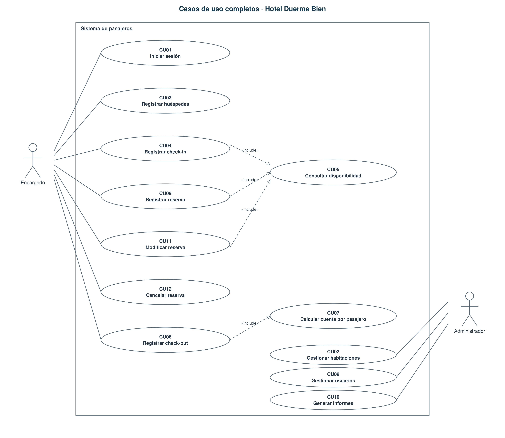
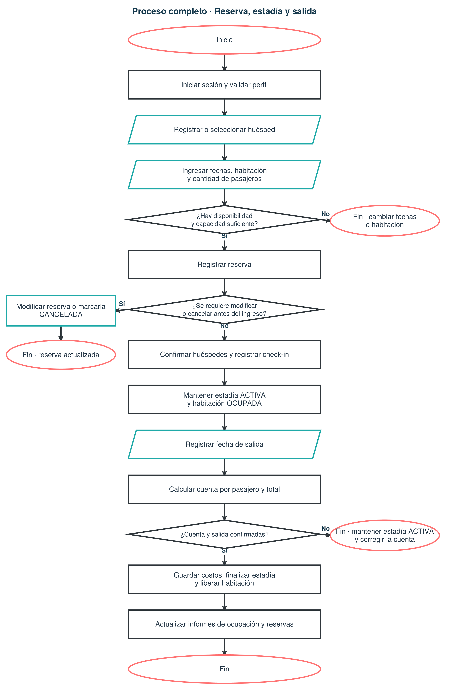
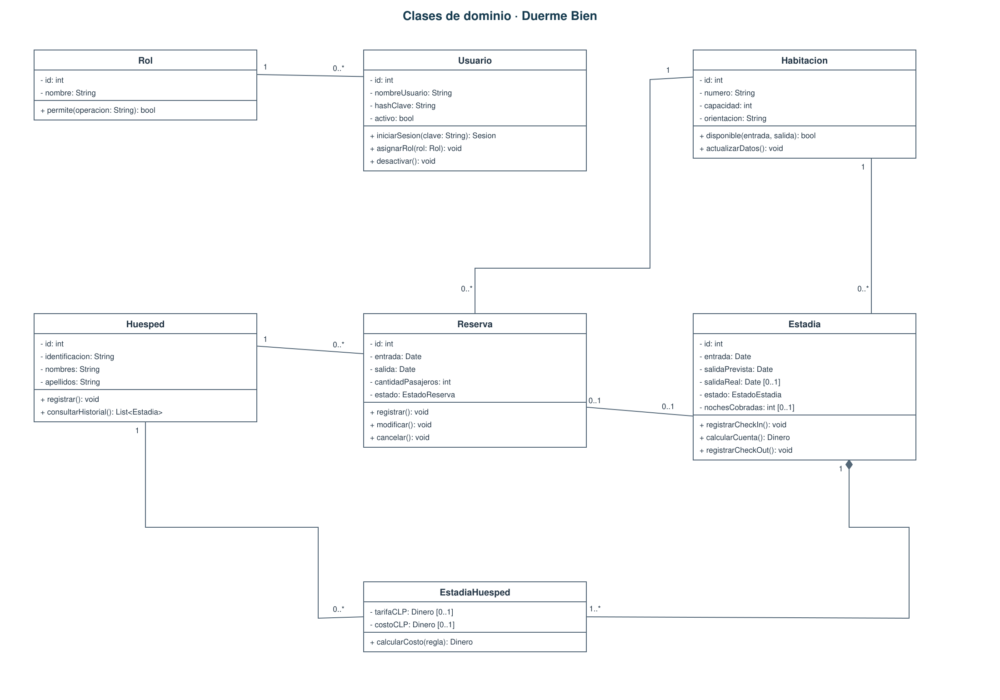
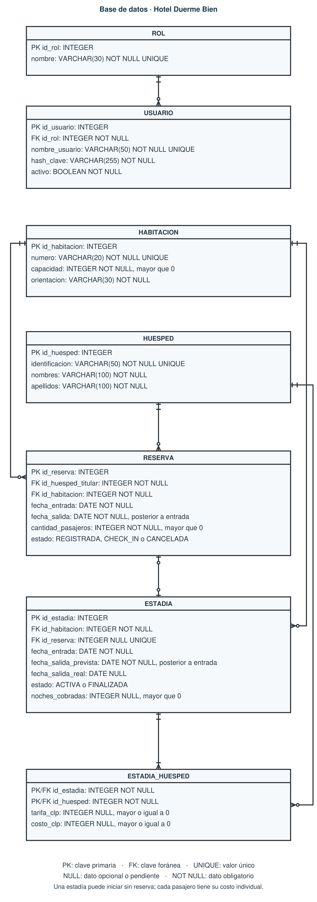
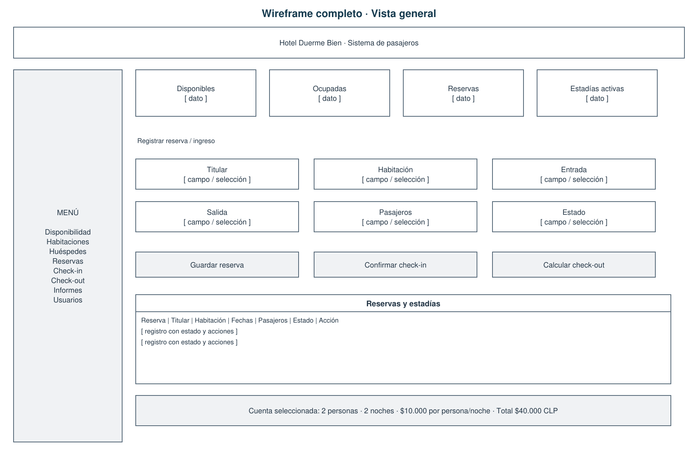
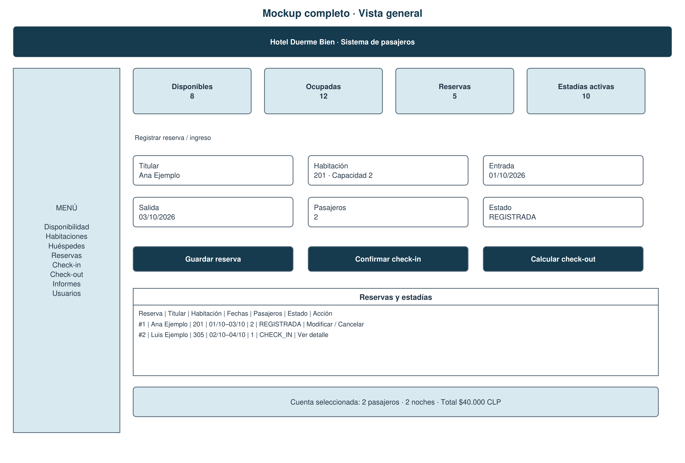
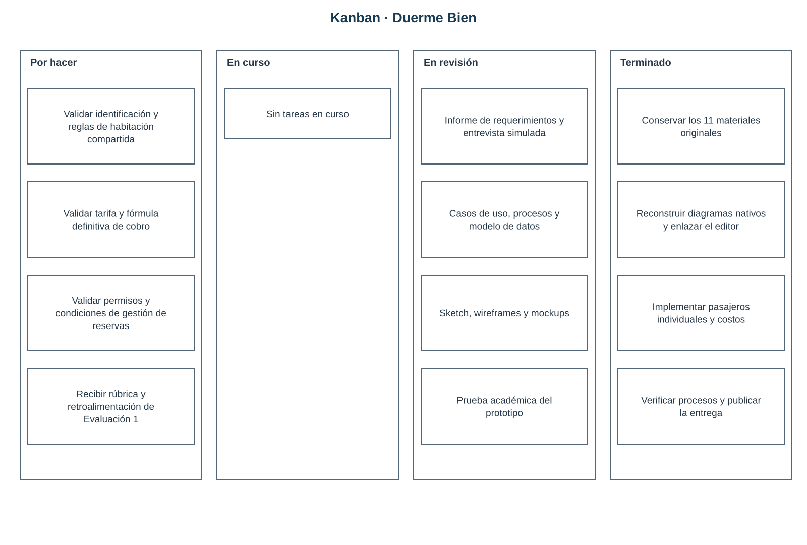

# Hotel Duerme Bien

**Tema 6 · Sistema de Pasajeros de Hotel · Luis Huenchul**

[Demo en Figma](https://www.figma.com/proto/7kS6Wuh6nwt2lcl4bB1w50/Hotel-Duerme-Bien?node-id=6-180&starting-point-node-id=6%3A180&scaling=contain) · [Informe completo](informe/informe-con-diagramas.pdf) · [Preguntas y respuestas](preguntas-y-respuestas-del-profesor.txt)

## Casos de uso

[Editar en diagrams.net](https://app.diagrams.net/?mode=device#Uhttps%3A%2F%2Fraw.githubusercontent.com%2FYutre3%2Fhotel-duerme-bien%2Fmain%2Fdiagramas-editables%2Fsistema-casos-de-uso.drawio)

## Diagrama de flujo

[Editar en diagrams.net](https://app.diagrams.net/?mode=device#Uhttps%3A%2F%2Fraw.githubusercontent.com%2FYutre3%2Fhotel-duerme-bien%2Fmain%2Fdiagramas-editables%2Fproceso-completo.drawio)

## Diagrama de clases

[Editar en diagrams.net](https://app.diagrams.net/?mode=device#Uhttps%3A%2F%2Fraw.githubusercontent.com%2FYutre3%2Fhotel-duerme-bien%2Fmain%2Fdiagramas-editables%2Fdiagrama-de-clases.drawio)

## Base de datos

[Editar en diagrams.net](https://app.diagrams.net/?mode=device#Uhttps%3A%2F%2Fraw.githubusercontent.com%2FYutre3%2Fhotel-duerme-bien%2Fmain%2Fdiagramas-editables%2Fmodelo-de-datos.drawio)

## Wireframe

[Editar en diagrams.net](https://app.diagrams.net/?mode=device#Uhttps%3A%2F%2Fraw.githubusercontent.com%2FYutre3%2Fhotel-duerme-bien%2Fmain%2Fdiagramas-editables%2Fwireframe-completo.drawio)

## Mockup

[Editar en diagrams.net](https://app.diagrams.net/?mode=device#Uhttps%3A%2F%2Fraw.githubusercontent.com%2FYutre3%2Fhotel-duerme-bien%2Fmain%2Fdiagramas-editables%2Fmockup-completo.drawio)

## Kanban

[Editar en diagrams.net](https://app.diagrams.net/?mode=device#Uhttps%3A%2F%2Fraw.githubusercontent.com%2FYutre3%2Fhotel-duerme-bien%2Fmain%2Fdiagramas-editables%2Fkanban.drawio)

## Demo

[Abrir demo en Figma](https://www.figma.com/proto/7kS6Wuh6nwt2lcl4bB1w50/Hotel-Duerme-Bien?node-id=6-180&starting-point-node-id=6%3A180&scaling=contain)

## Informe y defensa

[Abrir informe](informe/informe-con-diagramas.pdf) · [Abrir preguntas con respuestas](preguntas-y-respuestas-del-profesor.txt)
