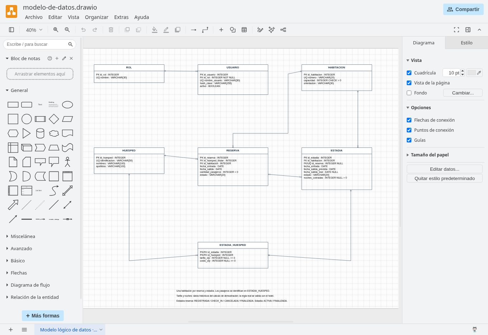

# Verificación de la entrega · 1 de octubre de 2026

- Pruebas del motor: permisos, capacidad, fechas, conflictos, pasajeros únicos, reservas, check-in, cuentas individuales y check-out.
- Pruebas de modelado: códigos de casos de uso, trazabilidad, dos salidas en decisiones, conectores vinculados y nueve pantallas en ambos niveles.
- Navegador público: reserva de habitación 201 para dos pasajeros del 1 al 3 de octubre; check-in con Ana y Luis; cálculo de dos noches a $10.000 por pasajero; $20.000 por persona y $40.000 total; check-out guardado y habitación liberada.
- Recarga del prototipo: el historial individual se conserva en este navegador.
- diagrams.net: el enlace abre modelo-de-datos.drawio con tablas y relaciones editables.

Datos, perfiles y tarifa son de demostración.

